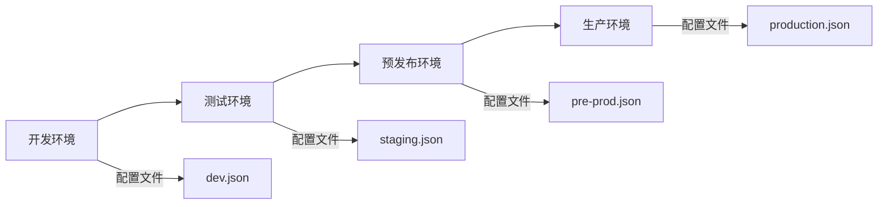

# 01-生产环境部署最佳实践

## 🏗️ 部署架构设计

### 1. 环境规划

#### 多环境配置策略



#### 环境隔离要点

**开发环境（Development）**
- 详细的调试日志
- 宽松的安全限制
- 快速的响应时间

**测试环境（Testing/Staging）**
- 模拟生产配置
- 完整的功能测试
- 性能基准测试

**生产环境（Production）**
- 最高的安全标准
- 优化的性能配置
- 有限的调试信息

### 2. 高可用性配置

#### 冗余部署方案

```yaml
# 高可用架构示例
production:
  instances:
    - region: us-east-1
      count: 2
      load_balancer: true
    - region: us-west-2
      count: 1
      failover: true

  monitoring:
    health_checks: true
    auto_recovery: true
    alerting: true

  backup:
    frequency: daily
    retention: 30_days
    cross_region: true
```

#### 负载均衡策略

- **轮询算法**：均匀分配请求
- **健康检查**：自动剔除故障节点
- **会话保持**：维护用户会话状态

## 🔒 安全配置

### 1. 认证与授权

#### API密钥管理

```bash
# 多级密钥管理
# 1. 主密钥（生产）
CLAUDE_API_TOKEN_PROD="sk-prod-..."

# 2. 测试密钥
CLAUDE_API_TOKEN_TEST="sk-test-..."

# 3. 开发密钥
CLAUDE_API_TOKEN_DEV="sk-dev-..."

# 4. 临时密钥（CI/CD）
CLAUDE_API_TOKEN_CI="sk-ci-..."
```

#### 权限控制矩阵

| 角色 | 读权限 | 写权限 | 管理权限 | 审计权限 |
|------|--------|--------|----------|----------|
| 开发者 | ✓ | ✓ | ✗ | ✓ |
| 运维 | ✓ | ✓ | ✓ | ✓ |
| 审计员 | ✓ | ✗ | ✗ | ✓ |
| 管理员 | ✓ | ✓ | ✓ | ✓ |

### 2. 网络安全

#### 通信加密

```json
{
  "security": {
    "tls": {
      "version": "1.3",
      "ciphers": [
        "TLS_AES_256_GCM_SHA384",
        "TLS_CHACHA20_POLY1305_SHA256"
      ]
    },
    "api_endpoint": "https://api.anthropic.com",
    "certificate_validation": true
  }
}
```

#### 访问控制

- **IP白名单**：限制访问来源
- **请求频率限制**：防止滥用
- **数据传输加密**：全程HTTPS

## ⚡ 性能优化

### 1. 响应时间优化

#### 上下文管理

```json
{
  "context": {
    "window_size": 12000,
    "compression": true,
    "caching": {
      "enabled": true,
      "ttl": 3600,
      "max_size": "1GB"
    },
    "compression_algorithm": "zstd"
  }
}
```

#### 并发处理

```json
{
  "performance": {
    "max_concurrent_requests": 10,
    "request_queue_size": 100,
    "timeout": 60000,
    "retry_policy": {
      "max_attempts": 3,
      "backoff_factor": 2,
      "jitter": true
    }
  }
}
```

### 2. 资源管理

#### 内存优化

- **缓存策略**：智能缓存常用响应
- **垃圾回收**：定期清理无用数据
- **内存限制**：防止单次请求占用过多

#### CPU优化

- **异步处理**：非阻塞操作
- **批处理**：合并相似请求
- **连接池**：复用网络连接

## 📊 监控与告警

### 1. 关键指标监控

#### 性能指标

| 指标 | 正常范围 | 告警阈值 | 严重阈值 |
|------|----------|----------|----------|
| 响应时间 | < 5s | 5-10s | > 10s |
| 成功率 | > 99% | 95-99% | < 95% |
| 并发数 | < 80% | 80-90% | > 90% |
| 错误率 | < 1% | 1-5% | > 5% |

#### 业务指标

- **请求量**：API调用频率
- **用户活跃度**：DAU/MAU
- **功能使用率**：各功能使用频率
- **满意度**：用户反馈评分

### 2. 告警配置

#### 告警级别

**INFO**：信息通知
- 系统启动/停止
- 配置更新
- 维护通知

**WARNING**：警告通知
- 性能下降
- 资源使用率高
- 部分功能异常

**ERROR**：错误通知
- 服务不可用
- 数据异常
- 安全事件

**CRITICAL**：严重告警
- 系统崩溃
- 数据丢失
- 安全漏洞

#### 通知渠道

```yaml
notifications:
  channels:
    - type: email
      recipients: ["ops@company.com", "dev@company.com"]
      severity: [ERROR, CRITICAL]

    - type: slack
      webhook: "https://hooks.slack.com/..."
      channel: "#alerts"
      severity: [WARNING, ERROR, CRITICAL]

    - type: pagerduty
      service_key: "your-pagerduty-key"
      severity: [CRITICAL]
```

## 🛠 部署脚本

### 快速部署脚本

```bash
#!/bin/bash
# deploy.sh - 生产环境快速部署

set -e

echo "🚀 开始ClaudeCode生产环境部署..."

# 1. 环境检查
echo "📋 检查部署环境..."
check_requirements() {
    command -v claude >/dev/null 2>&1 || { echo "❌ ClaudeCode未安装"; exit 1; }
    [ -n "$CLAUDE_API_TOKEN" ] || { echo "❌ API Token未设置"; exit 1; }
    echo "✅ 环境检查通过"
}

# 2. 配置部署
echo "⚙️ 部署配置文件..."
deploy_configs() {
    cp configs/production.json ~/.claude/config.json
    cp templates/production/.env ~/.claude/.env
    echo "✅ 配置文件部署完成"
}

# 3. 权限设置
echo "🔒 设置安全权限..."
setup_permissions() {
    chmod 600 ~/.claude/.env
    chmod 644 ~/.claude/config.json
    chown -R $USER:$USER ~/.claude
    echo "✅ 权限设置完成"
}

# 4. 验证部署
echo "✅ 验证部署结果..."
verify_deployment() {
    claude config validate
    claude --version
    echo "✅ 部署验证通过"
}

# 执行部署
check_requirements
deploy_configs
setup_permissions
verify_deployment

echo "🎉 部署完成！"
echo "📖 查看课件获取更多配置选项"
```

## 📋 部署检查清单

### 部署前检查

- [ ] 确认生产环境资源充足
- [ ] 备份现有配置和数据
- [ ] 准备回滚方案
- [ ] 通知相关人员

### 部署中检查

- [ ] 环境变量正确设置
- [ ] 配置文件语法正确
- [ ] 服务正常启动
- [ ] 监控系统正常

### 部署后验证

- [ ] 功能测试通过
- [ ] 性能指标正常
- [ ] 日志记录正常
- [ ] 告警系统正常
- [ ] 备份策略生效

---

## 📚 相关资源

- [生产环境配置模板](../configs/production.json)
- [自动化部署脚本](../scripts/setup.sh)
- [健康检查工具](../scripts/health-check.sh)
- [监控配置示例](../configs/monitoring.json)