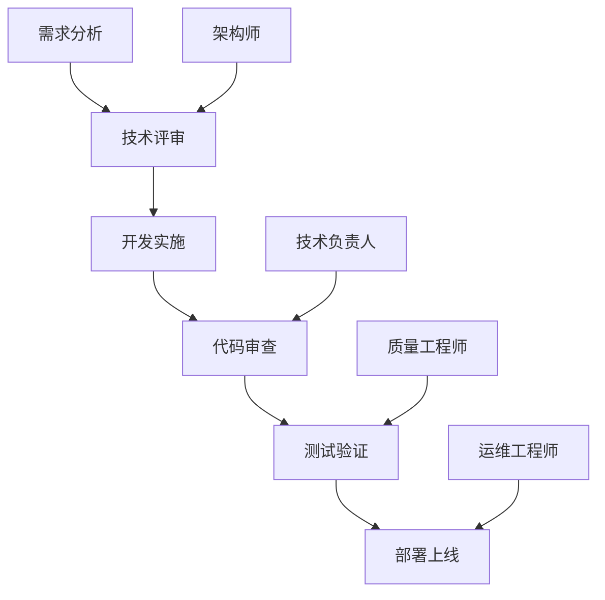

# 02-团队协作与工作流

## 👥 团队协作架构

### 1. 角色定义与职责

#### 核心角色矩阵

| 角色 | 主要职责 | 必备技能 | 权限范围 |
|------|----------|----------|----------|
| **架构师** | 技术选型、架构设计 | 系统设计、技术评估 | 全项目访问、配置管理 |
| **技术负责人** | 技术决策、代码审查 | 深度编码、团队管理 | 代码审查、部署权限 |
| **高级开发** | 核心功能开发 | 架构理解、问题解决 | 功能开发、测试权限 |
| **开发工程师** | 功能实现、单元测试 | 编程基础、协作 | 功能开发、基础权限 |
| **质量工程师** | 测试设计、质量保证 | 测试方法论、自动化 | 测试执行、报告权限 |

#### 协作模式设计



### 2. 工作流程标准化

#### 开发流程

```yaml
开发流程:
  阶段1: 需求分析
    输入: 产品需求文档
    活动: 技术可行性分析
    输出: 技术方案文档

  阶段2: 设计评审
    输入: 技术方案文档
    活动: 架构设计评审
    输出: 评审通过的设计文档

  阶段3: 开发实施
    输入: 设计文档
    活动: 功能开发、单元测试
    输出: 功能代码、测试报告

  阶段4: 代码审查
    输入: 功能代码
    活动: 代码质量检查
    输出: 审查通过代码

  阶段5: 集成测试
    输入: 审查通过代码
    活动: 集成测试、性能测试
    输出: 测试报告

  阶段6: 部署上线
    输入: 测试通过代码
    活动: 生产部署、监控
    输出: 线上功能
```

#### CI/CD集成

```yaml
ci_cd_pipeline:
  触发条件:
    - Git Push到main分支
    - Merge Request合并
    - 定时构建

  构建阶段:
    - 代码检出
    - 依赖安装
    - 静态代码分析
    - 单元测试
    - 集成测试

  部署阶段:
    - 环境准备
    - 配置部署
    - 健康检查
    - 自动化测试
    - 灰度发布
    - 全量发布

  监控阶段:
    - 服务监控
    - 性能监控
    - 错误监控
    - 告警通知
```

## 🔧 工具链整合

### 1. ClaudeCode集成

#### 配置标准化

```json
{
  "team_config": {
    "shared_skills": [
      "code-review",
      "documentation",
      "unit-test",
      "security-scan",
      "performance-analysis"
    ],
    "code_style": {
      "formatter": "prettier",
      "linter": "eslint",
      "style_guide": "company-standards"
    },
    "review_workflow": {
      "auto_review": true,
      "required_reviewers": 1,
      "approval_threshold": 2,
      "checklist": [
        "code_quality",
        "security_check",
        "performance_impact",
        "test_coverage",
        "documentation"
      ]
    }
  }
}
```

#### 技能集成

**代码审查技能**
```prompt
请对以下代码进行全面审查：
1. 检查代码质量和可读性
2. 识别潜在的安全风险
3. 评估性能影响
4. 确保测试覆盖率
5. 验证文档完整性

代码：{code_diff}
```

**文档生成技能**
```prompt
基于以下代码变更，生成：
1. 更新的API文档
2. 变更日志
3. 使用示例
4. 配置说明

代码变更：{changes}
```

### 2. 与现有工具链集成

#### Git集成

```bash
# .git/hooks/pre-commit
#!/bin/bash
# ClaudeCode集成检查

echo "🔍 运行ClaudeCode预提交检查..."

# 代码格式检查
claude format --check .

# 代码质量检查
claude review --diff HEAD~1 HEAD

# 安全扫描
claude security-scan

echo "✅ 预提交检查通过"
```

#### IDE集成

**VS Code配置**
```json
{
  "claudecode.enable": true,
  "claudecode.autoReview": true,
  "claudecode.formatOnSave": true,
  "claudecode.skills": [
    "code-completion",
    "error-detection",
    "refactoring"
  ]
}
```

## 📚 知识管理

### 1. 知识库建设

#### 知识分类体系

```yaml
知识库分类:
  快速入门:
    - 新人指南
    - 环境配置
    - 常见问题

  最佳实践:
    - 编码规范
    - 架构模式
    - 性能优化
    - 安全实践

  项目文档:
    - 项目架构
    - API文档
    - 数据库设计
    - 部署指南

  技术分享:
    - 会议记录
    - 技术博客
    - 案例研究
    - 经验总结
```

#### 文档标准化

```markdown
# 文档模板结构

## 概述
- 项目背景
- 核心功能
- 技术栈

## 架构设计
- 系统架构图
- 模块划分
- 数据流图
- 接口设计

## 实施细节
- 关键技术点
- 配置说明
- 部署步骤

## 最佳实践
- 经验总结
- 注意事项
- 常见问题

## 参考资料
- 相关文档
- 外部链接
```

### 2. 经验分享机制

#### 技术分享会

**月度技术分享**
```yaml
分享内容:
  - 新技术探索
  - 项目经验总结
  - 问题解决方案
  - 工具推荐

参与方式:
  - 内部技术论坛
  - 技术博客
  - 代码审查会议
  - 1对1指导
```

#### 代码审查最佳实践

**审查清单**

**代码质量**
- [ ] 代码逻辑清晰
- [ ] 变量命名规范
- [ ] 注释充分
- [ ] 无明显bug

**性能考虑**
- [ ] 算法效率合理
- [ ] 数据库查询优化
- [ ] 缓存策略合适
- [ ] 资源使用合理

**安全性**
- [ ] 输入验证
- [ ] 权限控制
- [ ] 敏感数据保护
- [ ] 安全漏洞检查

## 🎯 团队文化建设

### 1. 协作文化

#### 核心价值观

- **开放透明**：信息共享，决策透明
- **持续学习**：鼓励学习新技术
- **质量第一**：追求代码质量
- **团队协作**：互相支持帮助

#### 沟通机制

**定期会议**
- 每日站会（15分钟）
- 每周技术分享（1小时）
- 每月回顾（2小时）
- 季度规划（半天）

**异步沟通**
- 即时通讯工具（Slack/Teams）
- 项目管理工具（Jira/Trello）
- 文档协作（Confluence/Notion）
- 代码平台（GitHub/GitLab）

### 2. 绩效评估

#### 评估指标

**个人指标**
- 代码提交数量
- 代码质量评分
- Bug修复率
- 知识分享贡献

**团队指标**
- 项目交付质量
- 交付及时率
- 客户满意度
- 团队稳定性

#### 激励机制

**技术成长**
- 技术培训机会
- 认证考试支持
- 会议参与支持
- 开源项目贡献

**团队奖励**
- 项目成功奖励
- 技术创新奖励
- 知识分享奖励
- 团队建设活动

## 📋 实施检查清单

### 团队协作准备

- [ ] 团队角色明确划分
- [ ] 工作流程标准化
- [ ] 工具链集成完成
- [ ] 知识库建设开始

### 流程执行检查

- [ ] 需求文档完整
- [ ] 设计评审通过
- [ ] 代码审查执行
- [ ] 测试验证完成
- [ ] 部署记录完整

### 持续改进

- [ ] 定期回顾会议
- [ ] 问题收集整理
- [ ] 流程优化更新
- [ ] 团队培训计划

---

## 📚 相关资源

- [团队配置模板](../configs/team.json)
- [代码审查脚本](../scripts/code-review.sh)
- [文档模板](../templates/team/)
- [知识库示例](../templates/knowledge-base/)