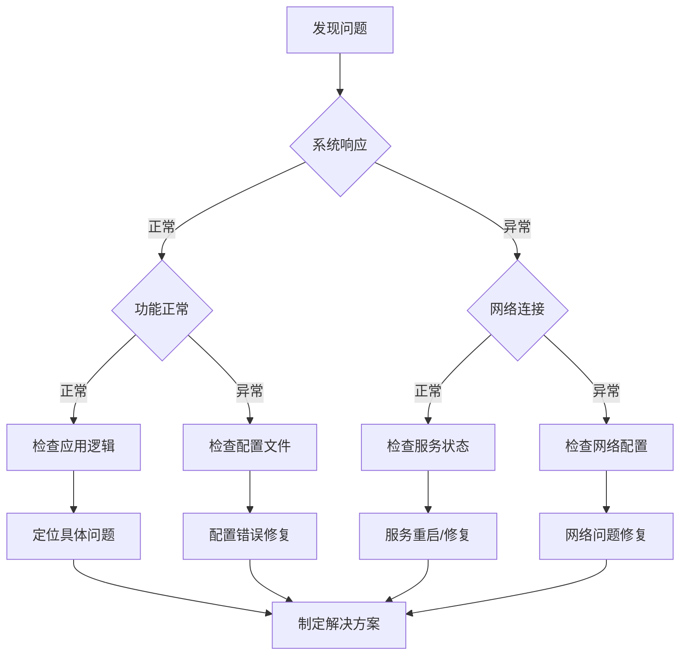

# 04-故障排除自动化

## 🔍 故障排除方法论

### 1. 系统化诊断框架

#### 四步诊断法

**步骤1：问题定位**
- 快速识别异常症状
- 收集相关日志信息
- 分析影响范围
- 确定问题类型

**步骤2：根因分析**
- 追溯问题发生路径
- 识别根本原因
- 分析相关因素
- 排除干扰项

**步骤3：解决方案**
- 制定修复策略
- 准备备选方案
- 评估实施风险
- 规划实施步骤

**步骤4：验证预防**
- 实施修复方案
- 验证问题解决
- 建立预防机制
- 更新知识库

#### 诊断决策树



### 2. 自动化诊断系统

#### 智能诊断架构

```yaml
诊断系统架构:
  数据收集层:
    - 系统日志收集
    - 应用指标收集
    - 网络状态监控
    - 用户行为分析

    数据处理层:
      - 日志解析引擎
      - 指标聚合分析
      - 异常模式识别
      - 关联分析引擎

    智能分析层:
      - 机器学习模型
      - 规则引擎
      - 专家系统
      - 知识图谱

    输出决策层:
      - 问题分类
      - 严重程度评估
      - 解决方案推荐
      - 自动执行决策
```

## 🛠 自动化工具集

### 1. 诊断脚本集合

#### 系统健康检查

```bash
#!/bin/bash
# health-check.sh - 系统健康全面检查

check_list=(
    "system_resources"
    "claude_service"
    "network_connectivity"
    "database_connection"
    "external_apis"
    "disk_space"
    "memory_usage"
    "process_status"
)

check_system_resources() {
    echo "📊 系统资源检查"

    # CPU使用率
    cpu_usage=$(top -bn1 | grep "Cpu(s)" | awk '{print $2}')
    echo "CPU使用率: $cpu_usage"

    # 内存使用
    mem_info=$(free -h | grep Mem)
    echo "内存状态: $mem_info"

    # 磁盘空间
    disk_info=$(df -h | grep -E "/$|/home|/var")
    echo "磁盘空间:"
    echo "$disk_info"

    # 负载情况
    load_avg=$(uptime | awk -F'load average:' '{print $2}')
    echo "系统负载: $load_avg"
}

check_claude_service() {
    echo "🤖 ClaudeCode服务检查"

    # 进程检查
    if pgrep -f claude > /dev/null; then
        echo "✅ ClaudeCode进程运行正常"
        echo "进程信息:"
        ps aux | grep claude | head -5
    else
        echo "❌ ClaudeCode进程未运行"
        return 1
    fi

    # 服务响应检查
    if curl -s --connect-timeout 5 http://localhost:8080/health > /dev/null; then
        echo "✅ 服务响应正常"
    else
        echo "❌ 服务响应异常"
        return 1
    fi
}

check_network_connectivity() {
    echo "🌐 网络连接检查"

    # DNS解析测试
    if nslookup api.anthropic.com > /dev/null 2>&1; then
        echo "✅ DNS解析正常"
    else
        echo "❌ DNS解析失败"
        return 1
    fi

    # HTTPS连接测试
    if curl -s --connect-timeout 10 https://api.anthropic.com > /dev/null; then
        echo "✅ HTTPS连接正常"
    else
        echo "❌ HTTPS连接失败"
        return 1
    fi

    # 延迟测试
    latency=$(curl -o /dev/null -s -w '%{time_total}' https://api.anthropic.com)
    echo "API延迟: ${latency}s"

    if (( $(echo "$latency > 5.0" | bc -l) 2>/dev/null); then
        echo "⚠️ 警告：延迟较高"
    fi
}

# 执行所有检查
main() {
    echo "=== ClaudeCode系统健康检查 ==="
    echo "检查时间: $(date)"
    echo "================================"

    issues_found=0

    for check in "${check_list[@]}"; do
        echo
        $check
        if [ $? -ne 0 ]; then
            ((issues_found++))
        fi
    done

    echo
    echo "================================"
    if [ $issues_found -eq 0 ]; then
        echo "🎉 系统状态良好，未发现问题"
    else
        echo "⚠️ 发现 $issues_found 个问题需要处理"
        echo "请查看详细日志进行修复"
    fi
}

main "$@"
```

#### 自动修复脚本

```bash
#!/bin/bash
# auto-fix.sh - 自动修复常见问题

fix_claude_service() {
    echo "🔧 修复ClaudeCode服务"

    # 重启服务
    echo "重启ClaudeCode服务..."
    if systemctl restart claudecode; then
        echo "✅ 服务重启成功"
    else
        # 尝试手动重启
        pkill -f claude 2>/dev/null
        sleep 2
        claude start &
        echo "✅ 手动重启完成"
    fi

    # 验证修复
    sleep 5
    if pgrep -f claude > /dev/null; then
        echo "✅ 服务修复成功"
        return 0
    else
        echo "❌ 服务修复失败"
        return 1
    fi
}

fix_permissions() {
    echo "🔧 修复文件权限"

    config_dir="${CLAUDE_CONFIG_DIR:-$HOME/.claude}"

    # 创建配置目录
    if [ ! -d "$config_dir" ]; then
        mkdir -p "$config_dir"
        echo "创建配置目录: $config_dir"
    fi

    # 设置正确权限
    chmod 755 "$config_dir"
    chown -R $USER:$USER "$config_dir" 2>/dev/null
    echo "✅ 权限修复完成"
}

fix_network() {
    echo "🔧 修复网络连接"

    # 清理DNS缓存
    if command -v systemctl > /dev/null; then
        systemctl restart systemd-resolved
    else
        # 手动清理
        echo "nameserver 8.8.8.8" >> /etc/resolv.conf
    fi

    # 测试连接
    if curl -s --connect-timeout 5 https://api.anthropic.com > /dev/null; then
        echo "✅ 网络连接修复成功"
        return 0
    else
        echo "❌ 网络连接仍有问题"
        return 1
    fi
}

# 修复决策树
fix_issues() {
    echo "开始自动修复..."

    issues_found=0
    fixed_count=0

    # 检查并修复权限问题
    check_permissions
    if [ $? -ne 0 ]; then
        fix_permissions
        ((fixed_count++))
    fi

    # 检查并修复网络问题
    check_network
    if [ $? -ne 0 ]; then
        fix_network
        ((fixed_count++))
    fi

    # 检查并修复服务问题
    check_claude_service
    if [ $? -ne 0 ]; then
        fix_claude_service
        ((fixed_count++))
    fi

    echo
    echo "修复完成: $fixed_count 个问题已修复"
}

# 执行修复
fix_issues
```

### 2. 智能故障检测

#### 异常模式识别

```python
# anomaly_detector.py
import numpy as np
from sklearn.ensemble import IsolationForest

class AnomalyDetector:
    def __init__(self):
        self.model = IsolationForest(contamination=0.1)
        self.training_data = []
        self.threshold = -0.5

    def train(self, metrics_data):
        """训练异常检测模型"""
        self.training_data = metrics_data
        self.model.fit(metrics_data)

    def detect(self, current_metrics):
        """检测异常"""
        if len(self.training_data) == 0:
            return False

        # 重塑数据
        current_reshaped = np.array(current_metrics).reshape(1, -1)

        # 预测异常分数
        anomaly_score = self.model.decision_function(current_reshaped)[0]

        return anomaly_score < self.threshold

    def update_model(self, new_data, labels):
        """增量更新模型"""
        # 结合新数据重新训练
        combined_data = np.vstack([self.training_data, new_data])
        self.model.fit(combined_data)
        self.training_data = combined_data
```

#### 智能故障诊断

```python
# intelligent_diagnostic.py
class IntelligentDiagnostic:
    def __init__(self):
        self.symptom_patterns = {
            'slow_response': {
                'indicators': ['high_response_time', 'low_throughput'],
                'causes': ['high_cpu', 'memory_leak', 'network_latency'],
                'solutions': ['scale_up', 'optimize_code', 'cache_improvement']
            },
            'high_error_rate': {
                'indicators': ['5xx_errors', 'timeouts', 'connection_refused'],
                'causes': ['service_unavailable', 'overload', 'configuration_error'],
                'solutions': ['check_service', 'reduce_load', 'update_config']
            },
            'service_unavailable': {
                'indicators': ['connection_refused', 'timeout', 'service_down'],
                'causes': ['service_crash', 'infrastructure_issue', 'dns_failure'],
                'solutions': ['restart_service', 'check_infrastructure', 'update_dns']
            }
        }

    def diagnose(self, symptoms):
        """智能诊断问题"""
        matched_patterns = []

        for pattern_name, pattern_info in self.symptom_patterns.items():
            matches = 0
            for indicator in pattern_info['indicators']:
                if indicator in symptoms:
                    matches += 1

            confidence = matches / len(pattern_info['indicators'])
            if confidence > 0.5:
                matched_patterns.append({
                    'pattern': pattern_name,
                    'confidence': confidence,
                    'causes': pattern_info['causes'],
                    'solutions': pattern_info['solutions']
                })

        # 按置信度排序
        matched_patterns.sort(key=lambda x: x['confidence'], reverse=True)
        return matched_patterns
```

## 📊 监控与告警

### 1. 实时监控系统

#### 监控指标收集

```python
# metrics_collector.py
import time
import psutil
import requests
from datetime import datetime

class MetricsCollector:
    def __init__(self):
        self.metrics_buffer = []
        self.collection_interval = 30

    def collect_system_metrics(self):
        """收集系统指标"""
        return {
            'timestamp': datetime.now().timestamp(),
            'cpu_usage': psutil.cpu_percent(),
            'memory_usage': psutil.virtual_memory().percent,
            'disk_usage': psutil.disk_usage('/').percent,
            'network_io': psutil.net_io_counters()._asdict()
        }

    def collect_application_metrics(self):
        """收集应用指标"""
        try:
            response = requests.get('http://localhost:8080/metrics', timeout=5)
            return {
                'timestamp': datetime.now().timestamp(),
                'status_code': response.status_code,
                'response_time': response.elapsed.total_seconds(),
                'metrics': response.json() if response.headers.get('content-type') == 'application/json' else {}
            }
        except:
            return {
                'timestamp': datetime.now().timestamp(),
                'status_code': 0,
                'response_time': 0,
                'error': 'Connection failed'
            }

    def start_collection(self):
        """开始收集指标"""
        print("📊 开始收集系统指标...")

        while True:
            system_metrics = self.collect_system_metrics()
            app_metrics = self.collect_application_metrics()

            # 合并指标
            combined_metrics = {
                **system_metrics,
                **app_metrics
            }

            # 存储到缓冲区
            self.metrics_buffer.append(combined_metrics)

            # 保持缓冲区大小
            if len(self.metrics_buffer) > 1000:
                self.metrics_buffer = self.metrics_buffer[-500:]

            time.sleep(self.collection_interval)
```

### 2. 智能告警系统

#### 告警规则引擎

```python
# alerting_system.py
class AlertingSystem:
    def __init__(self):
        self.alert_rules = []
        self.notification_channels = []

    def add_rule(self, rule):
        """添加告警规则"""
        self.alert_rules.append(rule)

    def add_notification_channel(self, channel):
        """添加通知渠道"""
        self.notification_channels.append(channel)

    def evaluate_alerts(self, metrics):
        """评估告警条件"""
        alerts = []

        for rule in self.alert_rules:
            if rule.should_alert(metrics):
                alert = {
                    'rule_name': rule.name,
                    'severity': rule.severity,
                    'message': rule.generate_message(metrics),
                    'timestamp': datetime.now().timestamp(),
                    'metrics': metrics
                }
                alerts.append(alert)

        return alerts

    def send_alerts(self, alerts):
        """发送告警通知"""
        for alert in alerts:
            for channel in self.notification_channels:
                if channel.supports_severity(alert['severity']):
                    channel.send(alert)
```

## 🔧 自动化解决方案

### 1. 自动恢复机制

#### 自愈系统

```python
# self_healing_system.py
class SelfHealingSystem:
    def __init__(self):
        self.healing_strategies = {
            'service_crash': self.restart_service,
            'high_cpu': self.scale_resources,
            'memory_leak': self.restart_service,
            'disk_full': self.cleanup_storage
        }

    def handle_failure(self, failure_type, context):
        """处理故障"""
        if failure_type in self.healing_strategies:
            return self.healing_strategies[failure_type](context)
        else:
            return self.escalate_issue(failure_type, context)

    def restart_service(self, context):
        """重启服务"""
        print(f"🔄 重启服务: {context.get('service_name', 'unknown')}")

        try:
            # 停止服务
            os.system(f"systemctl stop {context['service_name']}")
            time.sleep(5)

            # 启动服务
            os.system(f"systemctl start {context['service_name']}")
            time.sleep(10)

            # 验证服务状态
            if self.check_service_health(context['service_name']):
                print("✅ 服务重启成功")
                return True
            else:
                print("❌ 服务重启失败")
                return False

        except Exception as e:
            print(f"❌ 重启服务时出错: {e}")
            return False

    def scale_resources(self, context):
        """扩展资源"""
        print("📈 扩展系统资源")

        # 增加容器实例
        # 这是示例，实际实现取决于部署环境
        success = True

        if success:
            print("✅ 资源扩展成功")
            return True
        else:
            print("❌ 资源扩展失败")
            return False
```

### 2. 预防性维护

#### 定期维护任务

```bash
#!/bin/bash
# maintenance.sh - 预防性维护脚本

daily_maintenance() {
    echo "🔧 执行每日维护任务"

    # 清理日志文件
    find /var/log -name "*.log" -mtime +7 -delete
    find /tmp -name "*.tmp" -mtime +1 -delete

    # 检查磁盘空间
    disk_usage=$(df / | awk 'NR==2 {print $5}' | sed 's/%//')
    if [ $disk_usage -gt 80 ]; then
        echo "⚠️ 警告：磁盘使用率过高: $disk_usage%"
        # 清理缓存
        claude cache clean
    fi

    # 检查系统更新
    if command -v apt > /dev/null; then
        apt update -qq
    fi
}

weekly_maintenance() {
    echo "🔧 执行每周维护任务"

    # 清理应用缓存
    claude cache clean

    # 优化数据库
    optimize_database

    # 检查安全更新
    check_security_updates

    # 生成性能报告
    generate_performance_report
}

monthly_maintenance() {
    echo "🔧 执行每月维护任务"

    # 全面系统检查
    perform_full_system_check()

    # 更新配置
    update_configurations()

    # 备份重要数据
    backup_critical_data()

    # 性能基准测试
    run_performance_benchmark()
}
```

## 📋 实施指南

### 部署自动化工具

```bash
# 部署脚本
#!/bin/bash
# deploy.sh

echo "🚀 部署故障排除自动化工具"

# 1. 创建脚本目录
mkdir -p /opt/claudecode/tools
cd /opt/claudecode/tools

# 2. 复制脚本文件
cp health-check.sh .
cp auto-fix.sh .
cp monitor.sh .
chmod +x *.sh

# 3. 设置定时任务
(crontab -l 2>/dev/null; echo "0 */6 * * * /opt/claudecode/tools/health-check.sh") | crontab -
(crontab -l 2>/dev/null; echo "*/5 * * * * /opt/claudecode/tools/monitor.sh") | crontab -

# 4. 配置日志轮转
cat > /etc/logrotate.d/claudecode-tools << EOF
/opt/claudecode/tools/*.log {
    daily
    rotate 7
    compress
    delaycompress
    missingok
    notifempty
    create 644
}
EOF

echo "✅ 部署完成"
```

### 配置监控仪表板

```yaml
# dashboard-config.yml
dashboard:
  title: "ClaudeCode故障监控"
  refresh_interval: 30

  panels:
    - title: "系统状态"
      metrics:
        - system_health
        - service_status
        - error_rate

    - title: "性能指标"
      metrics:
        - response_time
        - throughput
        - resource_usage

    - title: "告警历史"
      metrics:
        - alert_count
        - alert_severity
        - resolution_time
```

---

## 📚 相关资源

- [健康检查脚本](../scripts/health-check.sh)
- [自动修复脚本](../scripts/auto-fix.sh)
- [监控脚本](../scripts/monitor.sh)
- [诊断工具集合](../tools/diagnostic/)
- [配置模板](../configs/alerting.json)